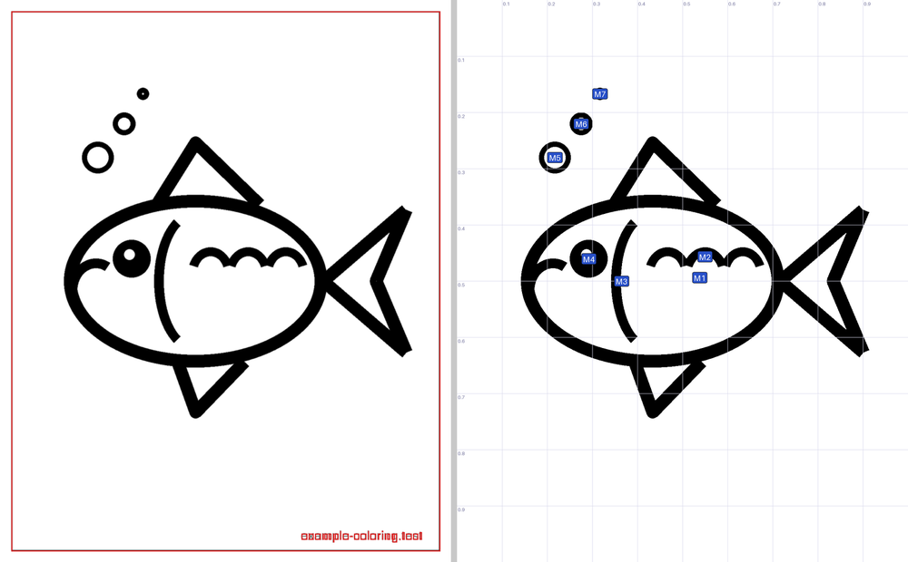
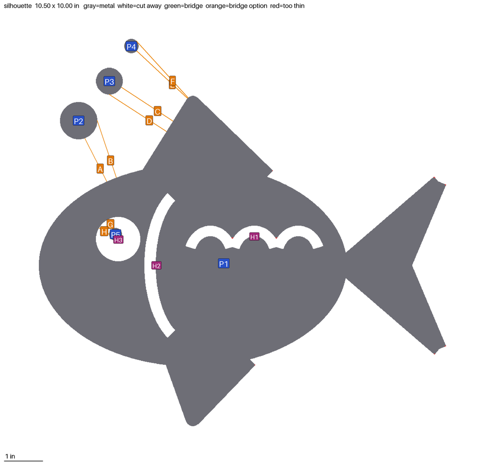
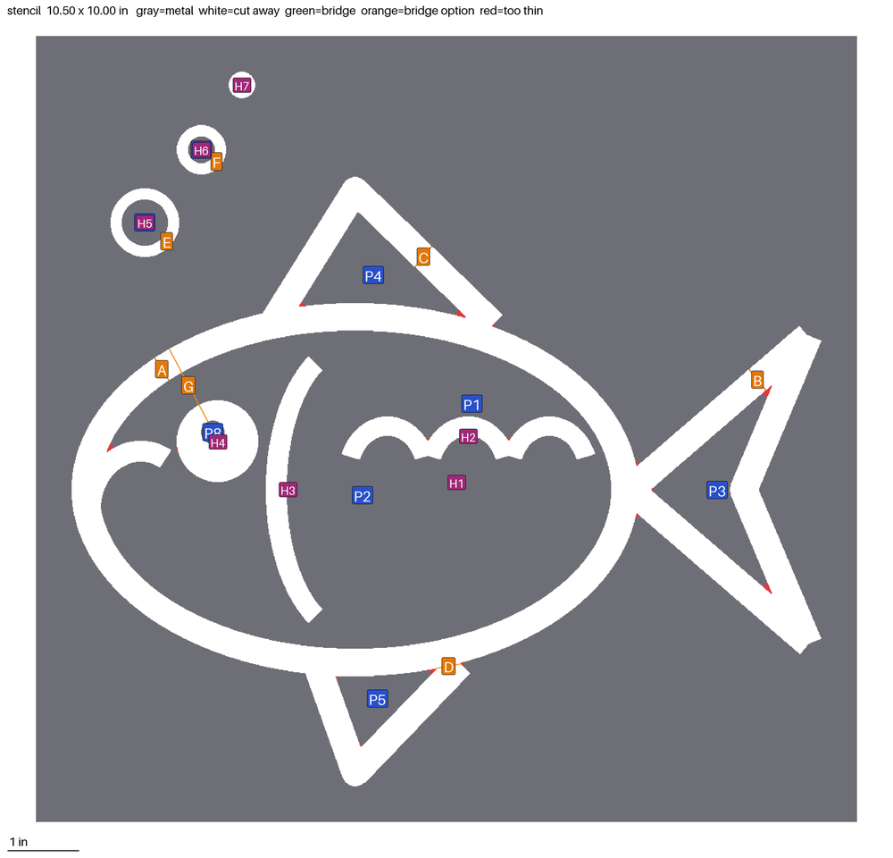
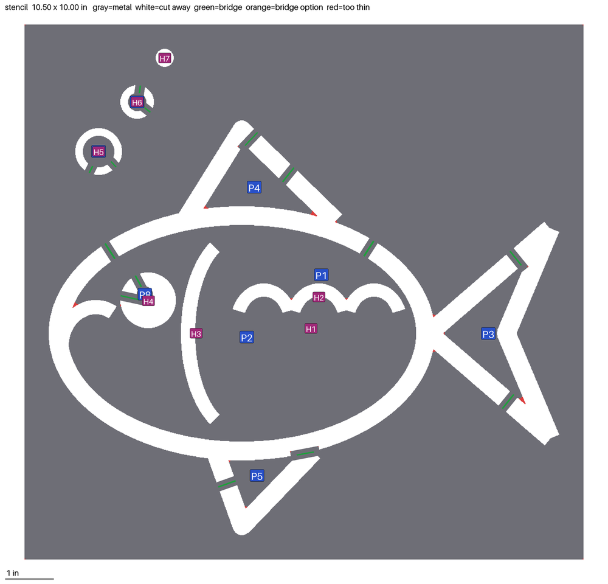
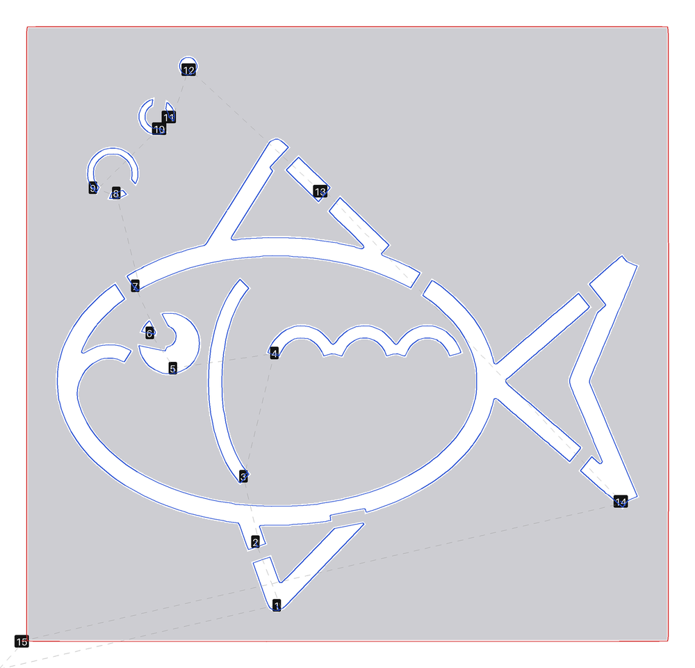
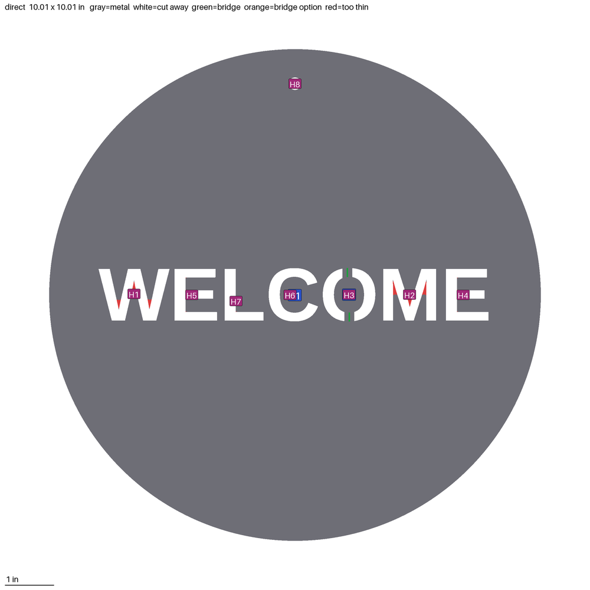
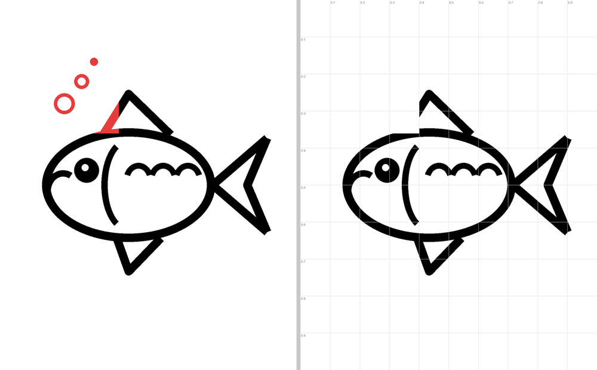

# What Plasma Path can do, with examples

This is a tour of the skill once it's installed (see [INSTALL.md](INSTALL.md)
for that). Every picture below is a real preview the skill produced from
`images/fish.png`, a test drawing, or from a description.

## The short version

You give Claude a picture, or describe a shape and text, and say what you
want in plain words. Claude cleans up the drawing, shows you what will be
metal and what will be cut away, asks two or three questions, and hands
you a Mach3 file plus a picture of the torch path. You can change anything
by describing the change. Nothing is cut until you load the file on the
machine yourself.

## 1. It cleans up the picture first

Say: *"Cut this out of 14 gauge steel, about 10 inches tall."*

Claude shows you what it will work from. Left is your picture with the
removed bits boxed in red (here the page border and the watermark along
the bottom); right is the cleaned drawing, with each separate mark
numbered so you can point at one.

If something is wrong here, say so: *"the whiskers are missing"*, *"drop
mark 4"*, *"the writing in the corner needs to go"*. It handles fuzzy
JPEGs, scans with grain and tilt, photos with a gradient background,
white-on-dark logos, and coloured drawings (*"use only the red lines"*).

## 2. It shows you what will be metal

Gray is metal, white is cut away. **P1, P2...** are separate pieces of
metal, **H1, H2...** are holes. Orange letters are places where a loose
piece could be bridged to the rest. Red means a feature is thinner than
is safe to cut.

This is the fish as a **silhouette**, a solid shape with the enclosed
marks as holes:

The three bubbles (P2, P3, P4) and the eye highlight (P5) would fall out
of the sheet, so Claude offers bridge options A to H and asks. You answer
in words: *"bridge the bubbles at B, D and F, and make the eye solid"*, or
*"drop the bubbles, I don't need them"*.

## 3. Three ways to cut the same picture

Ask for what the part is for, and Claude picks the mode; or name it.

- **Silhouette**: a solid shape, enclosed marks become holes. Signs,
  ornaments, wall art. What you saw above.
- **Stencil**: a plate with the drawing cut out of it, for spray painting.
  Anything enclosed by a line needs a bridge or it falls out:

  

  Say *"bridge everything automatically"* and Claude adds two small tabs to
  each loose piece:

  

- **Line art**: the drawn lines themselves are the metal, like wire art.
  Fragile, but striking for bold drawings.

## 4. It shows you exactly what the torch will do

Before handing over the file, Claude draws the torch path from the file
itself, so what you see is what the machine gets. Red is the outline,
blue is the cutouts, dashed gray is the fast moves between cuts, and the
numbers are the cutting order (holes first, outline last, so the part
stays held in the sheet until the end). The gaps in the blue lines are
the bridges.

You get the `.nc` file, this picture, the finished size, the number of
pierces and a time estimate, plus a reminder of where to zero the machine.

## 5. It can make signs from nothing

Say: *"I want a 10 inch circle with WELCOME cut out in Arial, with a hole
at the top to hang it."* No picture needed:

Circles, rectangles with rounded corners, rings, and text alone. Text can
be cut through the shape or stand as the metal itself. Fonts: Arial-,
Times- and Courier-compatible, or any font file you attach. Letters with
enclosed parts (O, B, A, D) get bridges automatically, and text is shrunk
to fit the shape if you ask for more than fits. Mounting holes are one
sentence: *"quarter-inch holes in the top corners"*.

## 6. It edits the picture however you describe

Say: *"take out the bubbles"*, *"there's a bump where the stem was, make
that petal a clean oval"*, *"mirror it so it reads from the back"*,
*"fatten the thin lines"*, *"only keep the outline"*, *"straighten the
scan"*. Claude edits and shows before and after: red is what it removed,
green is what it added.

For anything the ready-made edits don't cover, Claude writes its own
image code on the spot. If you can describe it, it can usually do it.

## 7. It knows your material

Tell it the material and thickness once (or put it in your Project) and
it sets the cutting speed, the pierce pause, the width the torch burns
away, and the thinnest feature it will allow. It tells you when it is
using a starting-point value that hasn't been proven on your table and
suggests a 1 inch test square. If a part comes out a hair big or small,
tell it the amount and it corrects the file.

## 8. Changing your mind

Everything stays adjustable in the same chat:

- *"Make it 14 inches instead."* Same design, new size, bridges kept.
- *"Actually make it a stencil."*
- *"Different metal: 1/8 inch aluminum."*
- *"Fill in the eyes, I want them solid."*
- *"Remove bridge 2 and put one at the tail instead."*

## What it won't do

- **Draw a new picture from a description.** No Claude app can generate
  images. Get the picture from Gemini in your Google account (or any
  generator) and drop it in; [INSTALL.md](INSTALL.md) has the prompt
  wording that gives cuttable results, and Claude will write the prompt
  for you if you ask.
- **Restyle a drawing** ("make it look hand-sketched"). Same reason.
  Simplify, smooth, outline and thicken are fine.
- **Write G-code by hand.** Every cut path comes from the same tested
  program, so a part today matches the parts already cut with it. That's
  a feature: Claude can't improvise a coordinate.
- **Add Z moves or torch height control.** The CrossFire has no Z axis,
  so the file is XY only and you set the torch height by hand.

## Tips for pictures that cut well

- Bold, connected lines. Thin whiskers and hair burn away.
- Black on white with no shading, or a photo with a plain background.
- Bigger source images are better; under about 300 pixels across, curves
  come out lumpy.
- If a picture has several things in it, say which one you want.
- Anything enclosed by a line will need a bridge in a stencil. Fewer
  enclosed areas means fewer tabs to grind off.
